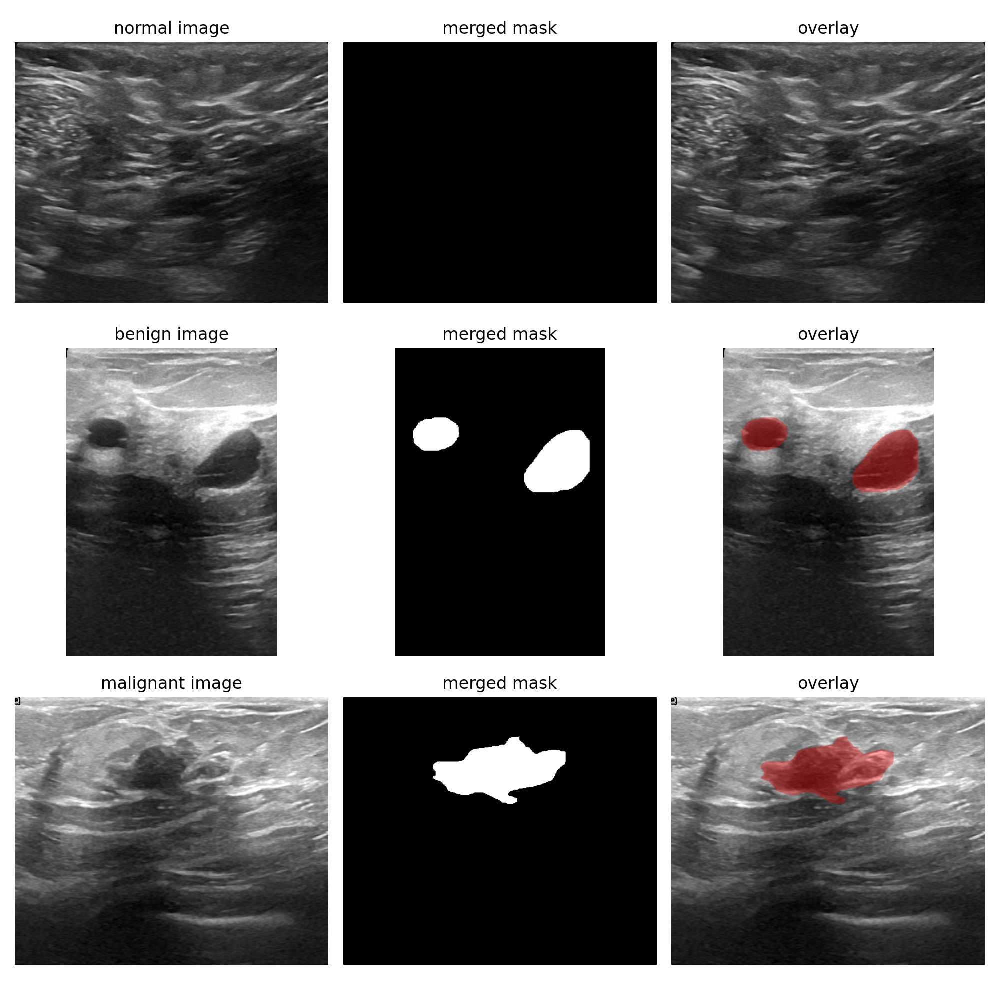
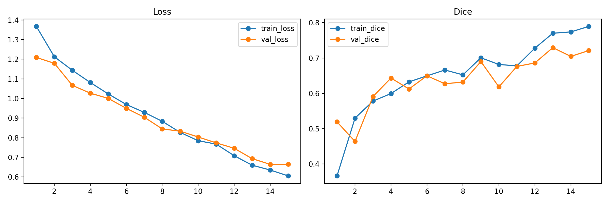
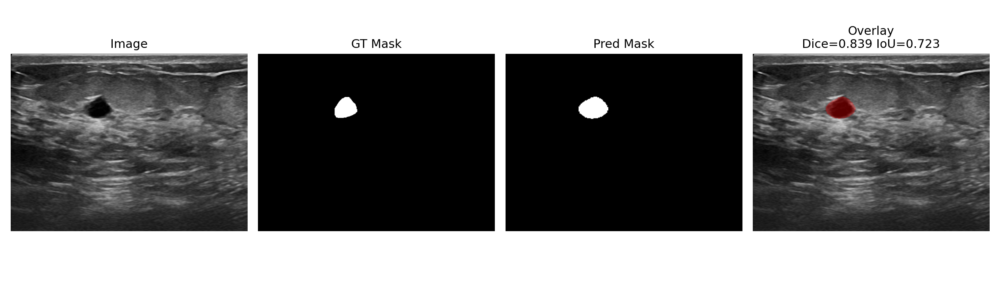
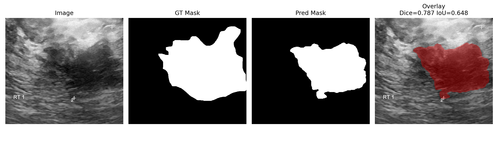
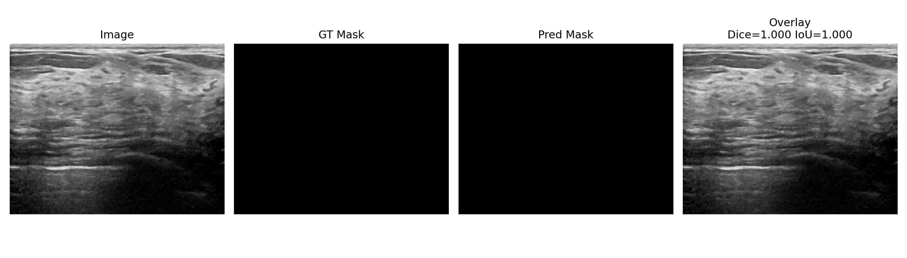
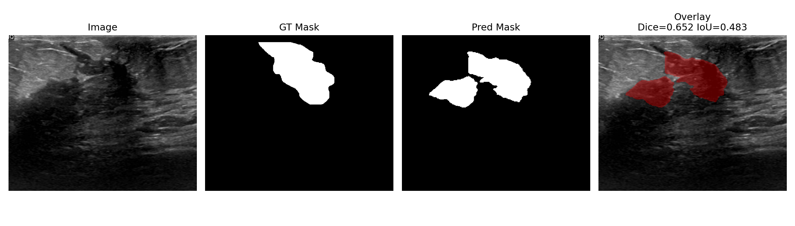

# BUSI Lesion Segmentation with U-Net

A medical imaging project for **breast ultrasound lesion segmentation** on the **BUSI (Breast Ultrasound Images)** dataset.

This project trains a **U-Net with a ResNet34 encoder** to segment lesion regions in breast ultrasound images and evaluates performance using **Dice** and **IoU** metrics.

> This repository is a **research prototype** for educational and experimentation purposes only.  
> It is **not** a medical diagnosis or clinical decision-making system.

---

## Overview

Breast ultrasound is a widely used imaging modality for breast lesion assessment.  
In this project, I built a lesion segmentation pipeline on the **BUSI dataset**, where the model predicts a binary lesion mask from an ultrasound image.

The pipeline includes:

- BUSI image and mask parsing
- merging multiple masks per image
- train / validation / test split
- U-Net training with a pretrained ResNet34 encoder
- evaluation with Dice and IoU
- qualitative overlay visualization

---

## Dataset

This project uses the **BUSI (Breast Ultrasound Images Dataset)**.

### Total images
- **780 ultrasound images**

### Class distribution
- **Benign:** 437
- **Malignant:** 210
- **Normal:** 133

### Notes
- Images from the **normal** class contain **empty masks**
- Some BUSI images may have multiple lesion masks, which were merged into a single binary mask during preprocessing

### Split
- **Train:** 546
- **Validation:** 117
- **Test:** 117

> Note: this project uses an **image-level split** because reliable patient identifiers were not available in this dataset version.

---

## Model

- **Architecture:** U-Net
- **Encoder:** ResNet34 pretrained on ImageNet
- **Task:** Binary lesion segmentation
- **Input size:** 256 × 256
- **Loss:** BCEWithLogitsLoss + Dice loss
- **Optimizer:** AdamW
- **Training:** early stopping on validation Dice

---

## Results

### Best validation result
- **Best Validation Dice:** **0.729**

### Test set results
- **Test Dice:** **0.760**
- **Test IoU:** **0.687**
- **Test Loss:** **0.646**

These results show that the model is able to localize lesion regions reasonably well on BUSI, despite the small dataset size and the presence of normal images with empty masks.

---

## Visual Results

### Dataset samples


### Training history


### Qualitative predictions

#### Example 1


#### Example 2


#### Example 3


#### Example 4


Each qualitative image contains:
- original ultrasound image
- ground-truth mask
- predicted mask
- overlay with Dice and IoU

---

## Repository Structure

```text
busi-lesion-segmentation/
│
├── README.md
├── busi_segmentation.ipynb
├── history.csv
├── segmentation_summary.json
│
└── results/
    ├── dataset_samples.png
    ├── history_plot.png
    └── qualitative/
        ├── 00_benign__benign_15_.png
        ├── 01_benign__benign_32_.png
        ├── 02_benign__benign_301_.png
        ├── 03_malignant__malignant_2_.png
        ├── 04_benign__benign_269_.png
        ├── 05_normal__normal_61_.png
        ├── 06_normal__normal_77_.png
        ├── 07_normal__normal_92_.png
        ├── 08_malignant__malignant_178_.png
        ├── 09_benign__benign_187_.png
        ├── 10_benign__benign_316_.png
        └── 11_benign__benign_308_.png
